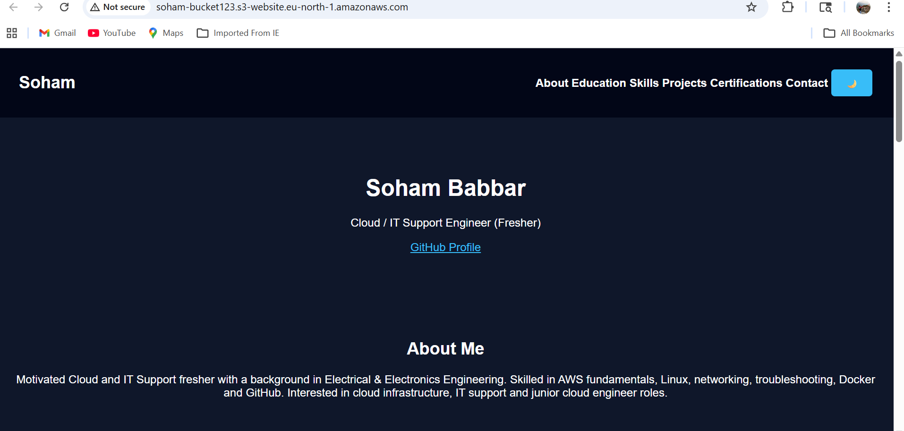

# Static Website Hosting on AWS S3 + CloudFront

## Overview
This project demonstrates static website hosting using Amazon S3 and content delivery through Amazon CloudFront.

## Services Used
- AWS S3
- AWS CloudFront
- HTML
- CSS
- JavaScript

## What I Did
- Created and configured an S3 bucket for static website hosting
- ## Screenshots

### S3 Bucket Configuration

### Final Website Output

- Uploaded website files to the S3 bucket
- Configured permissions for public access
- Integrated CloudFront for faster content delivery

## Outcome
Successfully hosted a static website on AWS and gained hands-on experience with cloud storage, hosting, and CDN configuration.
